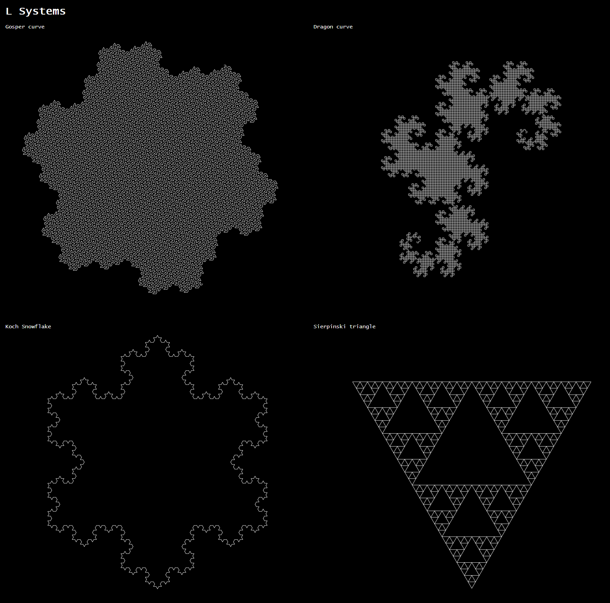

## L Systems

A small project that draws fractals on an HTML5 canvas using L Systems.

## Usage
Clone the repository and open the "LSystem.html" file.
The project uses Typescript so if you want to extend it, you can
- Install typescript (https://code.visualstudio.com/docs/typescript/typescript-compiling)
- open the project folder and run "tsc -b" (use "tsc -w" for watch mode)
- open the LSystem.html file

## Based on ideas by

<a href="https://www.reddit.com/r/proceduralgeneration/comments/gc9myc/fractal_halftoning/">flockaroo</a>
